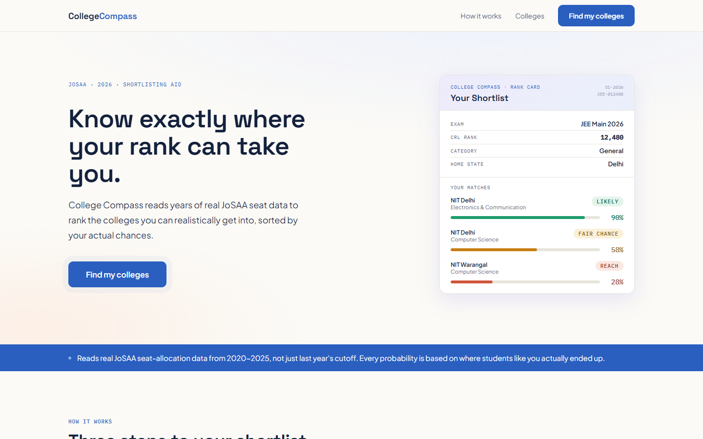
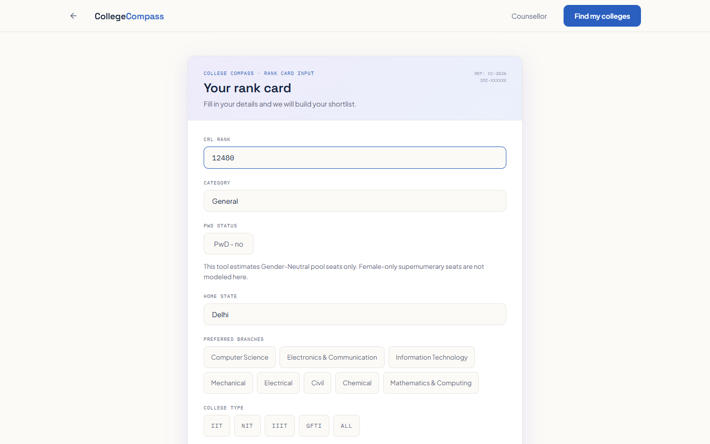
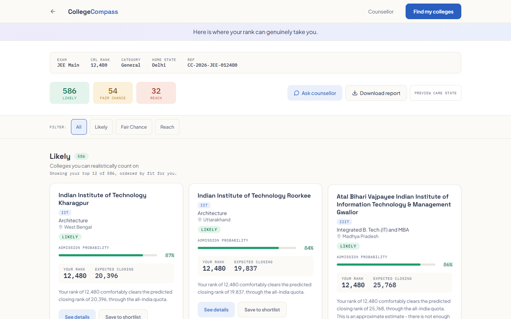
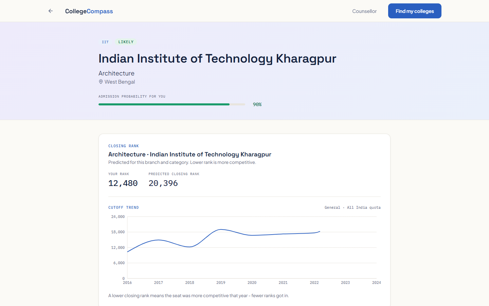
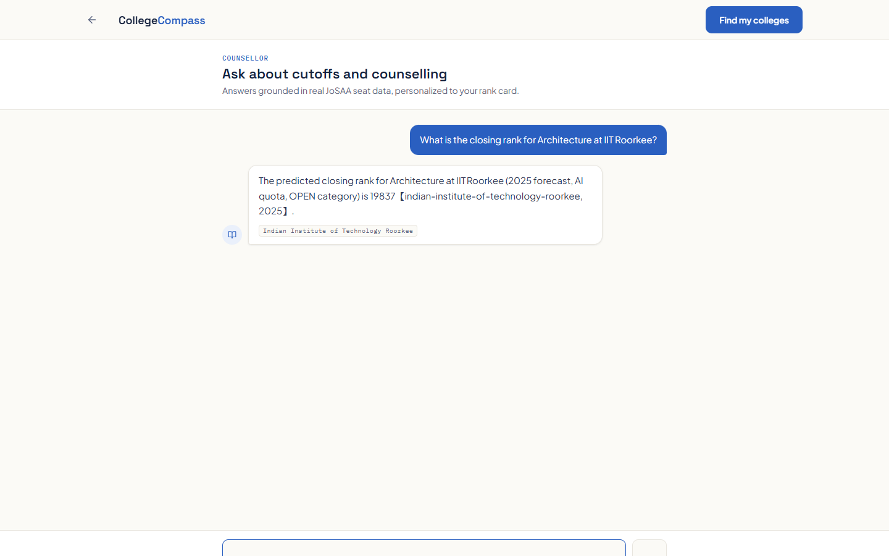
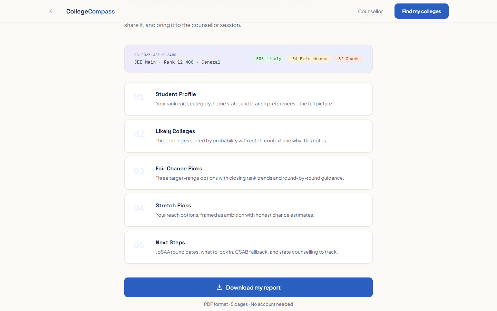
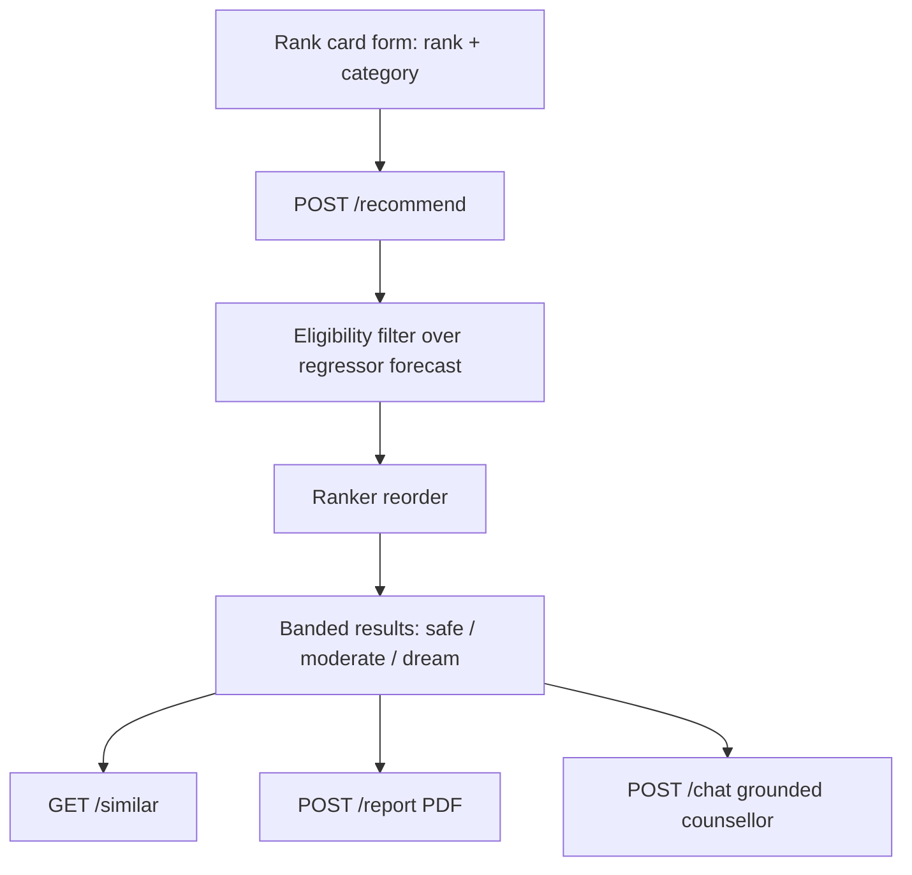

# College Compass

A JEE Main / JoSAA college recommendation system. Give it your rank and
category, get back eligible college-branches banded safe, moderate, and
dream, each with a predicted closing rank and a calibrated admission
probability. It also provides item-to-item "similar colleges" retrieval, a
grounded counsellor chatbot, and a downloadable PDF counselling report.

This is a decision aid, not an official JoSAA tool and not advice. See
[Scope and limitations](#scope-and-limitations) before you rely on it.

## The honesty premise

Every number on screen is one of three things: real historical JoSAA data,
a model output with an honest error story attached, or the student's own
input echoed back. Nothing is invented, which is what separates this from
the "predictor" sites that guess last year's cutoffs at you with false
confidence.

Two guarantees back that up, both enforced in code, not just written in a
prompt:

- Cold-start estimates are visibly different from confident ones. A college
  with too little year-over-year history gets a hatched confidence bar and
  an "approximate" label, in the UI and in the PDF. Never a clean bar for a
  wobbly number.
- The counsellor chatbot re-extracts every number it states and checks it
  against real retrieved data with an exact match. A number that doesn't
  match gets one stricter retry, then gets stripped from the answer rather
  than shown.

## Screenshots

*Not yet captured. Run the app locally (`python -m uvicorn api.main:app --port 8000`
and, in another terminal, `cd frontend && npm run dev`), then submit rank
`12480`, category `General`, home state `Delhi` on the rank card. That's the
same example profile the landing page's own sample shortlist uses, and it
naturally produces a mix of likely, fair chance, and reach results. Drop the
six images at the paths below with those exact filenames and the table in
this section's source will render.*

<!--
| | |
|---|---|
|  |  |
| The landing page, with the animated sample shortlist | The rank card, styled as an official document |
|  |  |
| Likely / fair chance / reach results, each with an animated probability meter | Cutoff trend, similar colleges, and the why-this-chance explanation |
|  |  |
| The counsellor answering a grounded question, with source chips | The report screen and its downloaded PDF |
-->

## Architecture, mapped

The request path end to end, from the student's form to every feature it
powers:



The PDF report and the grounded counsellor both reuse this exact
recommendation output. Neither recomputes anything. See "How it works"
below for what happens at each step.

A separate auto-generated dependency graph covers module-level coupling
instead of request flow: 500 nodes and 983 edges across 27 communities,
pulled straight from the source with AST parsing plus semantic extraction,
zero import cycles. Use it to audit coupling, not to follow the request
flow above. It predates the current frontend, so its backend and data
pipeline nodes hold up but its frontend-side nodes describe the previous
UI, due for a refresh. The SVG is at
[docs/architecture-graph.svg](docs/architecture-graph.svg), an interactive
version at [docs/architecture-graph.html](docs/architecture-graph.html),
and the full audit is in
[docs/ARCHITECTURE_GRAPH_REPORT.md](docs/ARCHITECTURE_GRAPH_REPORT.md).

## Quickstart

Backend:

```
pip install -r requirements.txt
cp .env.example .env
python -m uvicorn api.main:app --port 8000
```

The SQLite database and every trained model artifact (regressor, ranker,
calibrator, FAISS index) ship with the repo. Nothing needs to be rebuilt.
Startup loads them once; the API 503s until that finishes, then stays fast.

Frontend, in a second terminal:

```
cd frontend
npm install
cp .env.example .env
npm run dev
```

Open the printed local URL (`http://localhost:5173` by default). The
frontend pulls its own category and state options from the backend, so the
two can never drift out of sync.

`VITE_API_BASE` (in `frontend/.env`) is the backend's origin. Leave it blank
for local dev: every API call goes through the Vite dev server's own proxy
(`frontend/vite.config.ts`), which forwards the backend's root-mounted paths
(`/recommend`, `/chat`, `/report`, `/meta`, `/similar`, `/cutoffs`,
`/health`) to `http://localhost:8000`, so the browser never hits a CORS
wall. Set `VITE_API_BASE` to the real backend's origin only when the
frontend is built and served from somewhere the proxy can't reach, for
example a separately hosted static build.

For production, the simplest path is one process: run
`npm run build` inside `frontend/`, and the backend serves the result
directly, static assets and all, the moment `frontend/dist` exists. No
second server or reverse proxy needed. Hosting the frontend separately
works too. Either way, `CORS_ORIGINS` and `VITE_API_BASE` are the only two
settings that change.

## How it works

**Data pipeline.** A normalization step reconciles six public sources
(JoSAA round-level cutoffs, NIRF rankings, a hand-maintained fees and
hostel reference table) into one schema and loads it into SQLite. Postgres
is a one-env-var swap away for anyone who wants it; the substrate never
changes what the app computes.

**Cutoff regressor.** A LightGBM model predicts the year-over-year *change*
in a college-branch's closing rank, not the raw rank itself. Trees can't
extrapolate past what they were trained on, so predicting a delta and
adding it to last year's real number keeps every forecast inside the
model's trained range. A separate cold-start fallback model covers
college-branches with too little history for the main one.

**Eligibility and banding.** Given a rank and category, the system resolves
quota against home state and bands every reachable college-branch safe,
moderate, or dream based on how much margin the forecast gives you. This
step decides what you're eligible for; nothing downstream is allowed to
change that.

**Personalization ranker.** An LGBMRanker reorders eligible results by fit
(state, budget, branch taste, NIRF appetite) without ever touching
eligibility. Its relevance label is built from real revealed preference,
and closing-rank-derived signals are deliberately excluded from its
features, so it can't just learn to reconstruct the label from itself.

**Admission probability.** Isotonic calibration, fit on a held-out
validation year, corrects a residual-based raw probability. The result is
rounded to the nearest 5% before it's ever shown, so it never implies more
precision than the model actually has.

**Grounded counsellor.** The system routes a question to structured lookup
(a named college, reusing the exact forecast and probability numbers
`/recommend` already computed) or semantic retrieval (FAISS similarity, for
fuzzier questions), building a context bundle where every fact carries its
own source. The language model answers from that bundle, and a code-level
validator checks every number in the answer against it before the answer
is ever returned.

## Scope and limitations

Stated plainly, because a hidden limitation is worse than a stated one.

- **No placement, package, salary, or CTC data, anywhere, ever.** The
  counsellor declines those questions before they reach the language
  model. This is a deliberate exclusion, not a gap.
- **Gender-Neutral seats only.** Female-only supernumerary seats are a
  real, separate, smaller pool this system doesn't cover.
- **Forecasts are genuine forecasts.** Any year without a real closing-rank
  label is evaluated on held-out past years, never on data that doesn't
  exist yet.
- **A decision aid, not an official source.** Fees are coarse
  per-institute-type approximations. Check the institute's current fee
  circular before making a real decision.
- **Category rank, not CRL, for reserved categories.** OPEN uses overall
  rank; EWS/OBC-NCL/SC/ST use category rank, matching how JoSAA actually
  publishes its own cutoffs.
- **Grounding checks value membership, not attribution.** The validator
  confirms a stated number appears somewhere in the real retrieved data,
  but doesn't yet confirm it's the right *kind* of number for the right
  college. In a multi-college answer, a genuinely real figure could in
  principle get attached to the wrong college. Documented in
  [KNOWN_ISSUES.md](KNOWN_ISSUES.md), not yet hardened.
- **Large mixed questions can hit provider rate limits.** A counsellor
  question that both names a college and asks for alternatives can build a
  context large enough to exceed a free-tier LLM provider's per-minute
  token cap. The resulting error message doesn't yet distinguish that from
  a truly dead endpoint.
- **Don't trust short IIIT aliases for a handful of colleges, until fixed.**
  Colleges officially named "International Institute of Information
  Technology" (instead of the more common "Indian Institute of Information
  Technology") have their short name ("IIIT Bhubaneswar") silently resolve
  to the wrong, similarly-named IIT. The counsellor's answer is grounded in
  real data, but it's about the wrong college: ask by full official name
  for these until the underlying matcher is fixed.

Full detail on all of the above, plus what's already been tested and what
hasn't, is in [KNOWN_ISSUES.md](KNOWN_ISSUES.md).

## Tech stack

Backend: FastAPI, SQLAlchemy (SQLite locally, Postgres via one env var).
Machine learning: LightGBM, isotonic calibration, sentence-transformers
with a FAISS index. PDF: reportlab. Frontend: React 18, TypeScript, Vite,
react-router for routing, motion for animation, recharts for the cutoff
chart, lucide-react for icons, and a hand-authored CSS-variable design
system with no component framework.
